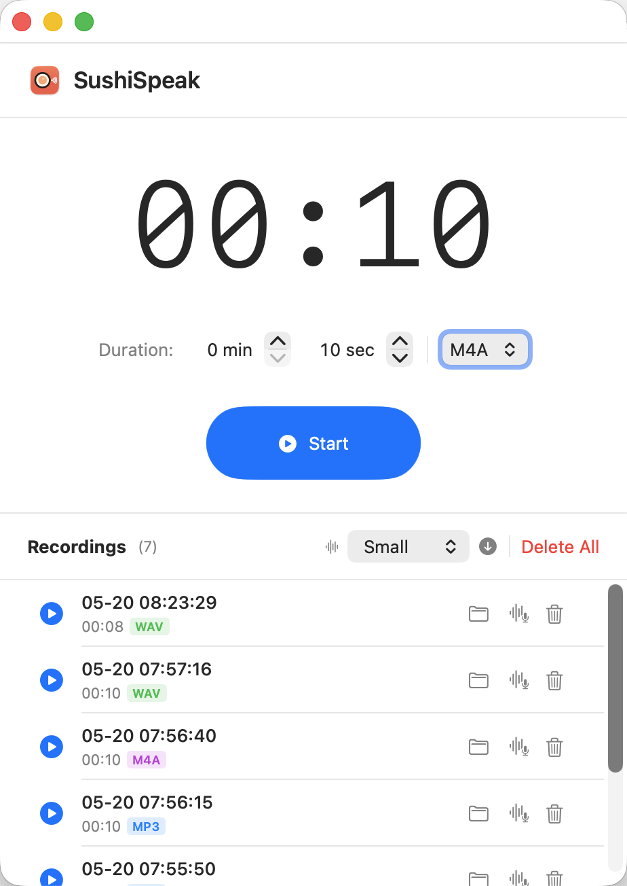

# SushiSpeak

A native macOS app for English speaking practice. Set a countdown timer, hit Start — it records your voice, shows a live waveform, and saves the audio when time's up.



## Features

- **Countdown timer** — MM:SS display, stepper controls for minutes and seconds, persists across launches
- **Auto record** — starts recording on Start, stops and saves on timeout or manual Stop
- **Live waveform** — animated bars driven by real microphone RMS level (flat when silent)
- **Audio format** — choose MP3 / M4A / WAV per session; format badge shown on each recording
- **Gain boost** — 2.5× input amplification so normal speaking volume comes out clearly
- **Recording list**
  - ▶ Play back inline
  - 📁 Reveal in Finder
  - 🎙 Transcribe with Whisper → result shown in popup, one-click copy
  - 🗑 Delete with confirmation; Delete All
- **Whisper transcription** — local on-device AI (whisper-cpp), supports Chinese / English / mixed
  - Models: Tiny / Base / Small (default) / Medium / Large V3
  - Download models in-app; progress shown in header
- **System alert** — sound + Dock bounce when session ends (no notification permissions needed)

## Requirements

- macOS 13 or later
- Xcode Command Line Tools: `xcode-select --install`
- ffmpeg (Homebrew): `brew install ffmpeg` *(for dev mode only — bundled in production build)*
- whisper-cpp (Homebrew): `brew install whisper-cpp` *(for dev mode only — bundled in production build)*

## Build & Run

```bash
cd ~/code/SushiSpeak
./build.sh          # release build: bundles ffmpeg + whisper-cli, opens app
./build.sh -d       # dev build: uses system Homebrew tools, faster iteration
```

Output: `.build/SushiSpeak.app`

Install permanently:
```bash
cp -r .build/SushiSpeak.app ~/Applications/
```

## Whisper Models

On first use, select a model and click the download button (↓) in the Recordings header.  
Models are stored in `~/Library/Application Support/SushiSpeak/models/`.

| Model | Size | Speed |
|-------|------|-------|
| Tiny | ~75 MB | fastest |
| Base | ~142 MB | fast |
| **Small** | **~466 MB** | **default** |
| Medium | ~1.5 GB | accurate |
| Large V3 | ~3.1 GB | most accurate |

## Recordings Location

`~/Documents/SushiSpeak/rec_<timestamp>.<format>`
